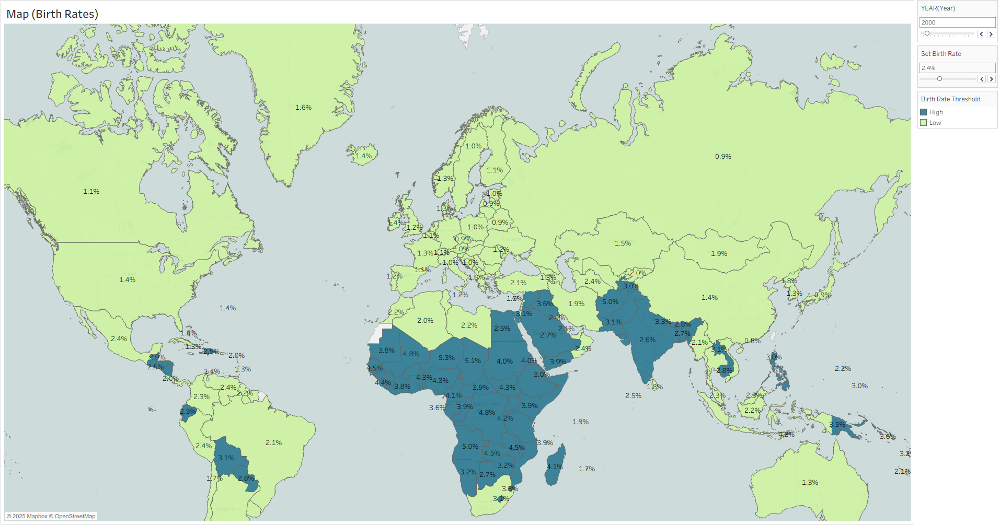

# 🌍 Global Birth Rates — Interactive Tableau Dashboard  

An interactive data visualization built in **Tableau**, showing global birth rates by country.  
Includes dynamic controls to explore **temporal** and **threshold-based** patterns.  

---

## 🎯 Overview  

This dashboard visualizes how birth rates vary across the world and over time.  
You can:  
- Use the **Year Slider** (top right) to change the displayed year.  
- Adjust the **Birth Rate Threshold Slider** to redefine what counts as a “High” vs “Low” birth rate.  
  - Sliding **left** increases the number of blue countries (higher birth rates).  
  - Sliding **right** increases the number of green countries (lower birth rates).  

---

## 🧭 Features  

- **Interactive Year Filter** — explore changes from 1960–2020 (or available range).  
- **Dynamic Threshold Adjustment** — fine-tune how countries are categorized by birth rate.  
- **Color-coded Choropleth Map** — instantly see global birth rate distribution.  
- **Data-driven Labels** — shows birth rate percentages directly on the map.  

---

## 🖼️ Preview  

---

## 💾 How to Use  

1. Download the `.twbx` file included in this repository.  
2. Open it in **Tableau Public** (free version available at [public.tableau.com](https://public.tableau.com)).  
3. Interact with the sliders in the top right corner to explore the data yourself.  

---

## 💡 Insights  

- Africa consistently shows the **highest birth rates** throughout most years.  
- Europe and East Asia remain **lowest** in global comparisons.  
- Adjusting the threshold gives a visual feel for **how the global fertility gap shifts** over time.  

---

## 🧰 Tools Used  

- **Tableau Public**  
- **Mapbox / OpenStreetMap** (for the world map layer)  
- **World Bank Dataset** (Birth rate, crude - per 1,000 people)  

---

## 💬 Summary  

This project demonstrates:  
- Effective **data storytelling** through interactive visualization.  
- Parameter-based **user control** for analytical exploration.  
- Clean design and strong attention to **usability and readability**.  

---

## ⚙️ About the Data  

Data sourced from the **World Bank Open Data** repository.  

---

## 🧠 Author  

Created by **[Your Name]** — Data Visualization & SQL Enthusiast.  

